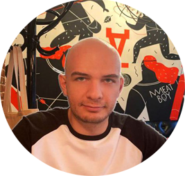

# Aleksandr Morozov
### Frontend Developer

* __Location__: Batumi, Ajaria, Georgia
* __Email__:  iceberginaction@gmail.com
* __Phone number__: +995 511 279 397
* __LinkedIn__: [Aleksandr Morozov](https://www.linkedin.com/in/alexander-morozov-532300253/)
* __Discord__: Aleksandr Morozov (@fantasy1302)
--------------------
### About Me 

Hello! I am a beginner web developer who is constantly learning and striving to gain new skills and knowledge. I am highly responsible and goal-oriented, with a strong desire to succeed. Although I have limited professional experience in web development, I am passionate about this field and committed to expanding my expertise.

### Experience
## Methodologist
- Volgograd State Pedagogical University, February 2023 - September 2023
- Volgograd, RU


As a professional with over two years of experience, I have had the opportunity to work in both education and technology. My early work involved developing projects related to online education, which gave me invaluable experience in developing scalable solutions for digital platforms. Eventually, I transitioned to a role as a frontend developer.

## Frontend Developer
- WellDone, November 2022 - Present
- Tbilisi, GEO


In my role at this company, I was responsible for developing interfaces using PHP, HTML, CSS, and JavaScript. I also provided support for the company's existing websites and worked with APIs to enhance their functionality.

Additionally, I have experience working with WordPress, including installation and development of themes and plugins, as well as ensuring the security of WordPress sites. I enjoy working with WordPress and am passionate about leveraging its capabilities to create user-friendly and engaging websites. Overall, I am excited about the opportunity to bring my skills and experience to a new role and continue to grow as a developer.
### Education
- Master in Educational Psychology at Volgograd State Pedagogical University Volgograd, RU 2020
- CS50 2021
- HTML Academy 2020
- Stepik Intoduction to PHP 2020
- FreeCodeCamp - Responsive Web Design 2022
- Hexlet - JavaScript Basics 2022
- FreeCodeCamp - JavaScript Algorithms and Data Structures 2023

### Skills 

| Hard Skills | Soft Skills| 
|----------|----------|
| HTML  | Communication  | 
| CSS    | Problem-solving   | 
| SCSS   | Time management   | 
| Tailwind   | Attention to detail  | 
| Bootstrap   | Adaptability  | 
| JavaScript  |Continuous learning   | 
| PHP  | Collaboration  | 
| Webpack  | Teamwork    | 
| Photoshop  |  Empathy | 
| Figma  |   Creativity |
| Illustrator  |  Critical thinking  | 

### Language 

- English language proficiency: Level B1 (Intermediate) 
- During my PHD graduate studies, I passed an English proficiency exam with a score of 5 (out of 5).

### Code Samples
#### JavaScript

Testimonials slider: 

```
const testimonials = document.querySelectorAll('.testimonials__block');
const dots = document.querySelectorAll('.testimonials__button');
const bgImage = document.querySelector('.testimonials__section--bg');
const bgColor = document.querySelector('.testimonials__section');

dots.forEach((dot, index) => {
  dot.addEventListener('click', () => {
    testimonials.forEach(testimonial => {
      testimonial.classList.remove('testimonials--active');
    });
    testimonials[index].classList.add('testimonials--active');
    dots.forEach(dot => {
      dot.classList.remove('testimonials__button--active');
    });
    dot.classList.add('testimonials__button--active');
    switch (index) {
      case 0:
        bgImage.style.transition = 'all 0.9s ease';
        bgImage.src = "Images/man-cafe.jpg";
        bgColor.style.backgroundColor = '#2B6EEA';
        bgColor.style.transition = 'all 0.9s ease';
        break;
      case 1:
        bgImage.style.transition = 'all 0.9s ease';
        bgImage.src = "Images/tech-bg.jpg";
        bgColor.style.backgroundColor = '#00C4C4';
        bgColor.style.transition = 'all 0.9s ease';
        break;
      case 2:
        bgImage.style.transition = 'all 0.9s ease';
        bgImage.src = "Images/bg-3.jpg";
        bgColor.style.backgroundColor = '#ffcb57';
        bgColor.style.transition = 'all 0.9s ease';
        break;
      case 3:
        bgImage.style.transition = 'all 0.9s ease';
        bgImage.src = "Images/bg-4.jpg";
        bgColor.style.backgroundColor = '#ff333d';
        bgColor.style.transition = 'all 0.9s ease';
        break;
      case 4:
        bgImage.style.transition = 'all 0.9s ease';
        bgImage.src = "Images/bg-5.jpg";
        bgColor.style.backgroundColor = '#a960ee';
        bgColor.style.transition = 'all 0.9s ease';
        break;
    }
  });
});
```
